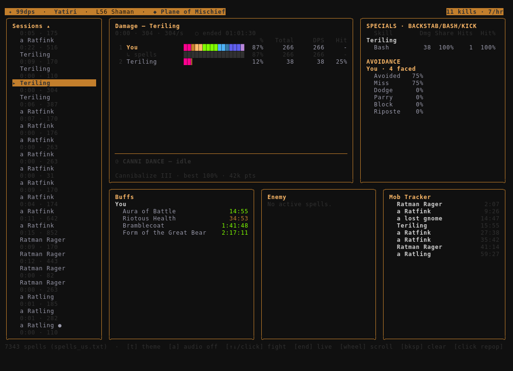

# 99dps

A terminal DPS meter for classic EverQuest (Project 1999). It tails your live log,
parses combat as it scrolls, and draws a themed real-time TUI — per-dealer damage,
crits, specials, avoidance, spell timers, and a zone repop tracker.

It only reads the log file your client already writes. No memory reading, no client
hooks, nothing injected into the game. Just the log.



## What you get

- **Live damage meter** — per-dealer DPS/total/share, hit% and crit%, a rainbow share bar.
  Pets roll up under their owner. Your spell/DoT damage is credited to you (the client
  only ever logs its *own* non-melee, so it's yours).
- **A panel that follows your class.** Caster → spell timers. Melee → skills + cooldowns.
  Hybrid → both. It figures out your class from `/who`.
- **Spell timers**, grouped by who you cast on: buffs on you/allies, debuffs/DoTs/roots on
  mobs, and a pinned CROWD CONTROL section for mez/charm/pacify. Two same-named mobs get
  their own timers, not one shared one.
- **Mob Tracker** — repop timers per kill using the zone's default spawn, split into your
  group's kills vs everyone else's. Click a row to fix a timer (saved per zone+mob).
- **Specials & Avoidance** — backstab/kick/bash totals and hit rates; dodge/parry/block/
  riposte/miss for each defender.
- **Shaman canni dance meter** pinned to the damage panel — grade, combo, recast beat, best.
- **Cooldowns, feign-death, bind-wound** indicators where the class warrants them.
- **Audio cues** (optional) when your buffs are about to drop.
- Switch characters in-game and it follows the new log automatically. No restart.

## Requirements

- A terminal that does truecolor (Windows Terminal, iTerm2, kitty, any modern one).
- Your EQ log file (`eqlog_<char>_<server>.txt`). Turn logging on in-game: `/log on`.
- `spells_us.txt` (ships with the client) for spell timers. Found automatically next to
  your log dir; without it the timer panel just stays empty, everything else still works.

## Build & run

Go 1.25+.

```sh
go run ./cmd/99dps                 # fastest; auto-detects your EQ folder, asks once
go run ./cmd/99dps -logdir <path>  # point it at your Logs dir
make build                         # -> ./99dps
```

Log dir resolution, in order: `-logdir` flag → `EQ_LOG_DIR` → your saved choice →
platform default → auto-detect (and it remembers what you pick). Override `spells_us.txt`
with `-spells <path>` if it isn't where it's expected.

Windows: `make windows` cross-compiles `99dps.exe` from any host (pure Go, no cgo).
`make dist-windows` builds a friend-ready zip. See [docs/windows-release.md](docs/windows-release.md).

## Keys

```
↑ ↓ / click   select a fight        end       jump to the live fight
wheel         scroll the panel       t / tab   cycle theme
a             toggle audio cues       bksp      clear sessions
click a repop row to set its timer    q         quit
```

## How it reads the log (and what it can't do)

EQ logs carry no entity IDs and never name the caster on spell damage. So:

- Two same-named mobs alive at once are identical text — the meter can't truly tell them
  apart. It uses sensible heuristics (a fresh re-cast vs a second mob, one death clears one
  timer) but it's a guess, not ground truth.
- There's no spell-DPS leaderboard, even for you. Spell lines say *what* was hit and *for how
  much*, never *by whom*. Your own non-melee is credited to you because your client only logs
  yours; everyone else's is invisible to you.
- The current zone is only known after you next zone in — no log line states it at startup.
- Repop times are zone *defaults*. Named/placeholder mobs differ; click to correct them.

## Fights start and stop on their own

A fight closes when combat goes quiet longer than its own rhythm (an adaptive idle-out, not a
fixed timer), so a frantic AoE pull and a slow tank-and-spank are each judged by their own
cadence. Kills are punctuation — a multi-mob pull stays one encounter. Death, zoning, and
camping hard-close a fight.

## Dev

```sh
go test ./...        # all tests live next to the code
make lint            # gofmt + vet + golangci-lint + govulncheck
```

Standard Go layout: `cmd/99dps/` is the entrypoint; everything else is under `internal/`
(`combat`, `eqclass`, `loader`, `parser`, `session`, `gamestate`, `tts`, `tui`). See
[CLAUDE.md](CLAUDE.md) for the architecture in depth.

## License

Personal project. Use it, break it, send a PR.
